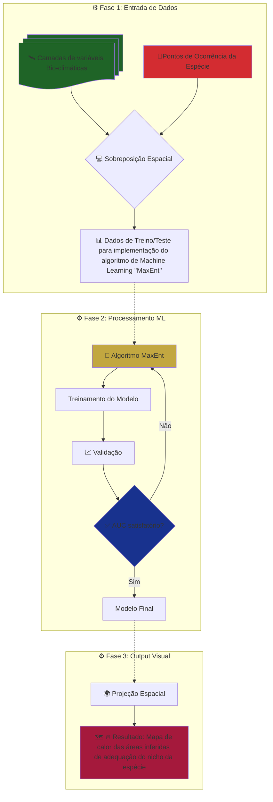

# Modelagem de Nicho Ecológico utilizando Machine Learning

## Sobre

Utilizei o algoritmo de machine learning "Maxent" - Maximum Entropy - na modelagem de nicho ecológico (ENM) de duas espécies aquáticas nativas de interesse econômico:

- ***Holothuria grisea*** (pepino do mar)
- ***Crassostrea tulipa*** (ostra)
  
**Objetivo Principal:** Inferir áreas ambientalmente adequadas para o cultivo  dessas espécies  no litoral brasileiro para promover a aquicultura sustentável e reduzir a dependência de espécies exóticas.

## Como funciona?

Visão esquemática do processo de Modelagem de Nicho Ecológico (ENM)

)
<small>Fonte: MARCELINO, Vanessa R.; VERBRUGGEN, Heroen. Ecological niche models of invasive seaweeds. Journal of Phycology, v. 51, n. 4, p. 606-620, 2015 (fig. 2).</small>

## Síntese dos Resultados

- **Modelagem com o algoritmo Maxent**: foram utilizados 117 pontos de ocorrência da espécie *H. grisea* e 21 pontos da espécie *C. tulipa*.

- **Seleção de variáveis**: foram selecionadas cuidadosamente 21 variáveis ambientais que não apresentavam multicolinearidade para *H. grisea* e 18 para *C. tulipa*.

- **Validação estatística**: foram utilizadas as métricas de área sob a curva (AUC), e o índice de Boyce contínuo (CBI), que atestaram um bom desempenho preditivo:
  - *Holothuria grisea*: AUC 0.990, e CBI entre 0.862 e 0.990
  - *Crassostrea tulipa*: AUC 0.996, e CBI entre 0.647 e 0.928

- **Identificação das áreas ambientalmente adequadas**: Resultados visuais através de mapas gerados pelo software do algoritmo.

- **Contribuição**: Incentivo da aquicultura de espécies nativas, alternativa mais sustentavelmente apropriada e com grande potencial econômico.
